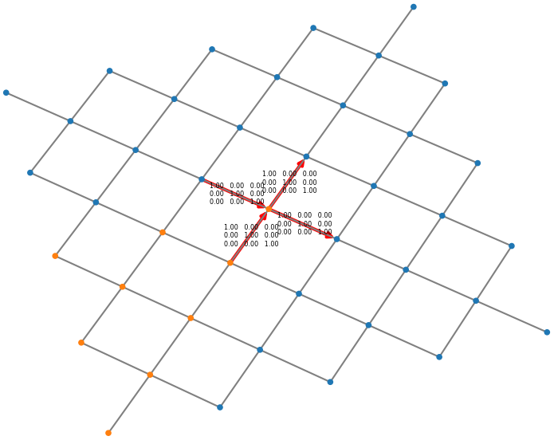
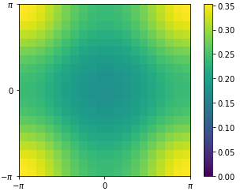
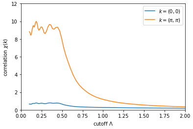
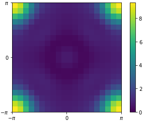
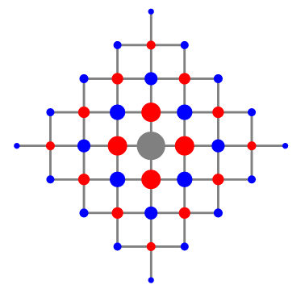

[](https://github.com/fbuessen/SpinParser/actions/workflows/build.yml)

# SpinParser

SpinParser ("Spin Pseudofermion Algorithms for Research on Spin Ensembles via Renormalization") is a software platform to perform pseudofermion functional renormalization group (pf-FRG) calculations to solve lattice spin models of quantum magnetism. 

The pf-FRG algorithm has first been proposed in [[Reuther and Wölfle (2010)](http://dx.doi.org/10.1103/PhysRevB.81.144410)] for Heisenberg models on two-dimensional lattices geometries. 

The current implementation of the SpinParser is based on a generalized approach [[Buessen et al. (2019)](http://dx.doi.org/10.1103/PhysRevB.100.125164)] which allows to solve general quantum spin Hamiltonians of the form 

<p align="center"></p>

where the sum over lattice sites i and j is defined on arbitrary two- or three-dimensional lattices and the spin operator  resembles the  component of a spin-1/2 moment at lattice site i.


## Table of contents
- [Overview](#overview)
- [Installation](#installation)
  - [Prerequisites](#prerequisites)
  - [Download sources](#download-sources)
  - [Build from source](#build-from-source)
  - [Install optional tools](#install-optional-tools)
- [Quick start](#quick-start)
  - [Prepare a task file](#prepare-a-task-file)
  - [Verify the model implementation](#verify-the-model-implementation)
  - [Run the calculation](#run-the-calculation)
  - [Evaluate SpinParser output and measurements](#evaluate-spinparser-output-and-measurements)
- [Developer documentation](#developer-documentation)

## Overview

Owing to the large class of spin models that can be studied within the pf-FRG approach, the aim of this software implementation is to provide fast, yet flexible numerics for the efficient solution of pf-FRG flow equations. 

To allow for easy and universal use, the spin model and the underlying lattice geometry can be defined as plain-text `.xml` files. 
The SpinParser provides a built-in abstraction layer to identify symmetries in the spin lattice model and exploit them in the subsequent solution of the flow equations. 

The numerical core for the solution of the flow equations themselves is designed to run on massively parallel high-performance computing platforms. 
It utilizes a hybrid OpenMP/MPI parallelization scheme to make efficient use of individual shared-memory computing nodes, while still allowing to scale across multiple computing nodes. 

Due to the algebraic nature of the flow equations (being a large set of coupled integro-differential equations) the computation time for individual contributions to the flow equations can vary. 
To mitigate the impact, SpinParser performs dynamic load balancing across the different computing nodes. 
It is thus in principle also possible to efficiently run the code on heterogeneous computing platforms. 

This software contains three different numerical cores, which are optimized for different classes of spin models: 
- A numerical core for spin-1/2 SU(2)-symmetric spin models with an extension for spin-S SU(2) models as put forward in [[Baez and Reuther (2017)](http://dx.doi.org/10.1103/PhysRevB.96.045144)]
- A numerical core for Kitaev-like spin-1/2 models with diagonal interactions as put forward in [[Reuther et al. (2011)](http://dx.doi.org/10.1103/PhysRevB.84.100406)]
- A numerical core for general spin-1/2 models which may include off-diagonal two-spin interactions as put forward in [[Buessen et al. (2019)](http://dx.doi.org/10.1103/PhysRevB.100.125164)]

## Installation

SpinParser needs to be built from source. The build process makes use of the [cmake](https://cmake.org) build system. 
SpinParser is relatively easy to compile and only depends on a few libraries. 
The build process is described in a step-by-step guide below, exemplified for Ubuntu 20.04 LTS. 

### Prerequisites

You need to ensure that the following software and libraries are installed on the system: 
* Cmake (version 3.16 or newer)
* Boost (version 1.71.0 or newer)
* HDF5 (version 1.10.4 or newer)
* MPI (optional, recommended)
* Doxygen (optional, required for generating documentation files)

Furthermore, in order for the optional python tools to work and tests to be evaluated correctly, a Python installation is required with the following libraries available:
* numpy
* h5py
* matplotlib

To ensure that all these libraries are installed, invoke the following OS specific commands in your terminal. (You might want to drop the `python` part if you already have a Python installation.)

*Linux:*

```bash
sudo apt install git cmake libboost-all-dev libhdf5-dev libopenmpi-dev doxygen graphviz python-is-python3 python3-pip
```

```bash
python3 -m pip install numpy h5py matplotlib
```

*MacOS (via Homebrew):*

```bash
brew install git cmake hdf5 boost doxygen graphviz libomp python
```

```bash
python -m pip install numpy h5py matplotlib
```

The SpinParser might also successfully build with older library versions. 
Especially when tests are disabled (see below), older versions of boost are also compatible; if the generation of documentation files is disabled (see below), older versions of cmake might work. 

### Download sources

Create and enter a working directory, say 
```bash
mkdir SpinParser && cd SpinParser
```
Next, clone a copy of the source files
```bash
git clone https://github.com/fbuessen/SpinParser.git SpinParserSource
```
which should leave you with a directory `SpinParserSource`, which, among other files and subdirectories, contains a file `CMakeLists.txt`. 

### Build from source

Now it is time to compile the sources. It is recommended to build the software in a separate directory, which we shall name `build`. 
Furthermore, we want to create a directory `install`, into which the final compiled software will be moved. 
Therefore, we create two directories and enter the separate build directory by executing (from within the original working directory `SpinParser`)
```bash
mkdir build && mkdir install && cd build
```
We instruct cmake to generate the makefiles for our project by invoking
```bash
cmake -DCMAKE_BUILD_TYPE=Release -DCMAKE_INSTALL_PREFIX=../install ../SpinParserSource
```
The above command includes two command line arguments which tell cmake how to build and install the code. 
The argument `-DCMAKE_BUILD_TYPE=Release` specifies that the generated code is intended to be used for production, i.e., the compiler is instructed to perform code optimization. 
Alternatively, we could set the value to `Debug` which would instruct the compiler to include debug symbols. 
The second argument, `-DCMAKE_INSTALL_PREFIX=../install` defines where the generated code will ultimately be moved. We intend to move it to the `install` directory which we created in the previous step. 

When executing the command, cmake attempts to locate all relevant libraries and files. 
On a simple Ubuntu installation, it should usually succeed in doing so. 
If this fails, for example because the libraries are installed in non-standard locations, it is possible to provide cmake with additional hints where to search for the libraries. 
For the boost library, such hint would be along the lines of `-DBOOST_ROOT=/path/to/boost/library`. For the HDF5 library, the hint would be `-DHDF5_ROOT=/path/to/hdf5/library`. 

Furthermore, the SpinParser build environment allows you to specify some additional options: 
* `-DSPINPARSER_BUILD_TESTS=OFF` disables building tests (ON by default).
* `-DSPINPARSER_BUILD_DOCUMENTATION=OFF` disables building the documentation / developer's reference (ON by default).
* `-DSPINPARSER_ENABLE_ASSERTIONS=ON` enables some additional memory boundary and consistency checks. Useful when deriving code or building your own extensions, but slows down the application (OFF by default).
* `-DSPINPARSER_DISABLE_MPI=ON` disables MPI parallelization, which allows code building on systems with no MPI library installed. Can be useful for simplified builds for instrumentation or debugging (OFF by default). 
* `-DSPINPARSER_DISABLE_OMP=ON` disables OpenMP parallelization. Can be useful for simplified builds for instrumentation or debugging (OFF by default). 

Once the `cmake` command has completed, the build files have been generated and we are ready to compile, test, and install the code. 
This is done by calling the sequence of commands (from within the `build` directory)
```bash
make -j6
make test
make install
```
Note that in order to speed up the compilation, we included the argument `-j6`, which instructs the compiler to launch 6 processes for parallel compilation. The number should be adjusted to the number of available CPU cores on your system. 

When the compilation is done, the final software is installed in the `install` subdirectory, which we enter by executing
```bash
cd ../install
```
The file structure in this directory should look like this: 
```
+ install/
	+ bin/
		- SpinParser
	+ doc/
		- index.html
		...
	+ examples/
		- square-Heisenberg.xml
		...
	+ opt/
		+ mathematica/
			- spinparser.m
		+ python/
			+ spinparser
				- ldf.py
				- obs.py 
	+ res/
		- lattices.xml
		- models.xml
```
The file `bin/SpinParser` is the main executable. 
Some example definitions of lattices and models are included in `res/lattices.xml` and `res/models.xml`, respectively. 
The developer documentation / API reference is located in `doc/index.html`, which you can open in your browser for reading. 

### Install optional tools
The SpinParser ships with a few optional tools which help in the evaluation of pf-FRG calculations; they are located in the `opt` directory. 

Most importantly, the collection contains some Python scripts located in `opt/python`. 
In order to use the Python tools, the directory `opt/python` should be added to the `$PYTHONPATH` environment variable, such that the scripts can be found by the Python installation. 

The Python module `spinparser.ldf` provides the following functions: 
- plot: Used to plot and verify lattice spin models used in SpinParser calculations. See the section "Verify the model implementation" for an example application. 

The Python module `spinparser.obs` provides functions to conveniently extract measurement data from SpinParser output files: 

- getLatticeBasis: Extract the set of lattice basis sites.
- getLatticePrimitives: Extract the set of primitive lattice vectors.
- getLatticeSites: Extract the list of all lattice sites.
- getCorrelation: Extract two-spin correlation measurements for various lattice sites and/or cutoff values.
- getStructureFactor: Calculate the structure factor at specified momentum points for various cutoff values. 

Examples for the use of the aforementioned commands can be found in the section "Evaluate SpinParser output and measurements". 

Usage instructions for the functions listed above can be obtained via the `help` function in Python, e.g.: 
```python
import spinparser.obs
help(spinparser.obs.getCorrelation)
```

Furthermore, the collection contains a Mathematica interface, which builds on the Python scripts. 
In order to use these tools, Mathematica must be [set up](https://reference.wolfram.com/language/ref/externalevaluationsystem/Python.html) to correctly interface with Python. 
Furthermore, the Python tools must correctly set up to be available via `import spinparser`. 
The Mathematica scripts are located in the directory `opt/mathematica`. 
For convenient use, the directory should be added to the Mathematica search path, e.g. by calling `AppendTo[$Path, "opt/mathematica"]` in Mathematica. 

Available functions are: 
- GetLatticePrimitives: Analogous to the Python version.
- GetLatticeSites: Analogous to the Python version.
- GetCorrelation: Analogous to the Python version.
- GetStructureFactor: Analogous to the Python version.
- PlotCorrelationFlow: Plot the flow of spin-spin correlations as a function of the cutoff. 
- PlotStructureFactorFlow: Plot the flow of the structure factor at specified momentum points as a function of the cutoff. 
Usage instructions for the functions listed above can be obtained via the `?` function in Mathematica, e.g.: 
```mathematica
<<SpinParser`
?SpinParser`PlotCorrelationFlow
```


## Quick start
Performing a calculation with the help of SpinParser consists of four steps:
1. Prepare a task file and define the microscopic lattice and spin model.
2. Ensure that your implementation is correct. 
3. Run the calculation. 
4. Evaluate SpinParser output and measurements. 


### Prepare a task file
The task file is an XML document which holds all input required to perform an FRG calculation.
This includes a reference to the underlying lattice, the spin model, information about frequency and cutoff discretizations, and instructions on the measurements to perform. 
An example task file is included in the SpinParser installation at `examples/square-Heisenberg.xml`: 
```XML
<task>
	<parameters>
		<frequency discretization="exponential">
			<min>0.005</min>
			<max>50.0</max>
			<count>32</count>
		</frequency>
		<cutoff discretization="exponential">
			<min>0.1</min>
			<max>50</max>
			<step>0.95</step>
		</cutoff>
		<lattice name="square" range="4"/>
		<model name="square-heisenberg" symmetry="SU2">
			<j>1.0</j>
		</model>
	</parameters>
	<measurements>
		<measurement name="correlation"/>
	</measurements>
</task>
```
This example defines an exponential frequency discretization, specified in the block `<frequency discretization="exponential">`. The distribution is generated symmetrically around zero with 32 frequencies in the range from 0.005 to 50.0, i.e., a total of 64 frequencies are used in the computation. 
Alternatively, an explicit list of values can specified by choosing `discretization="manual"` and providing the values as child nodes `<value>0.005</value> [...] <value>50.0</value>`. 

The cutoff discretization is automatically generated as an exponential distribution  down to the smallest cutoff value , according to the specification in the node `<cutoff discretization="exponential">`. 
Just like in the specification of the frequency discretization, it is also possible to specify `discretization="manual"`.

The lattice graph `<lattice name="square" range="4"/>` will be generated to include all lattice sites up to a four lattice-bond distance around a reference site. The name of the lattice, `square`, is a reference to a lattice definition found elsewhere. The actual lattice definition is found in the resource file `res/lattices.xml` file: 
```XML
<unitcell name="square">
	<primitive x="1" y="0" z="0" />
	<primitive x="0" y="1" z="0" />
	<primitive x="0" y="0" z="1" />

	<site x="0" y="0" z="0" />

	<bond from="0" to="0" dx="1" dy="0" dz="0" />
	<bond from="0" to="0" dx="0" dy="1" dz="0" />
</unitcell>
```
The software scans all `*.xml` files in the directory `../res` relative to the SpinParser executable for lattice implementations. 
If the directory does not exist, it scans the directory `../../res/` or the directory where the executable itself is located. 
Alternatively, the resource search path can be set manually by specifying the `--resourcePath` command line argument when launching SpinParser. 

A lattice definition consists of three `primitive` lattice vectors spanning the unit cell; each is defined by their x, y, and z component. 
The lattice unit cell, in this example, contains one basis site at the origin. Multiple basis sites are in principle possible, in which case they are enumerated by unique IDs according to their order, starting at 0. 
Finally, the lattice graph is generated according to the lattice bonds: Each bond connects two lattice sites, `from` and `to` (referenced by their ID), which may either lie within the same unit cell or be offset by dx, dy or dz unit cells into the direction of the first, second or third lattice vector, respectively. 

Similarly, the spin model `<model name="square-heisenberg" symmetry="SU2">` references the model `square-heisenberg` defined in the file `res/models.xml`:
```XML
<model name="square-heisenberg">
	<interaction parameter="j" from="0,0,0,0" to="1,0,0,0" type="heisenberg" />
	<interaction parameter="j" from="0,0,0,0" to="0,1,0,0" type="heisenberg" />
</model>
```
The software scans all `*.xml` files in the directory `../res/` relative to the SpinParser executable for spin model implementations. 
If the directory does not exist, it scans the directory `../../res/` or the directory where the executable itself is located. 
Alternatively, the resource search path can be set manually by specifying the `--resourcePath` command line argument when launching SpinParser. 

The model definition comprises a list two-spin interactions. All interactions for one lattice unit cell need to be specified, and the remaining interactions are inferred by periodicity of the lattice. 
The interaction is between two lattice sites `from` and `to`, each referenced by a tuple (a1,a2,a3,b), corresponding to the lattice site in unit cell (a1,a2,a3) (in units of the lattice vectors) and basis site ID b. 
The two-spin interaction type in this example is a Heisenberg interaction. 
Interactions can also be specified more fine-grained by replacing `heisenberg` e.g. with `xy`, which would correspond to the two-spin interaction . 
The `parameter` name is referenced in the task file to assign a numerical value to the coupling. 
In our example for the task file above, in the line `<j>1.0</j>`, the coupling is set to 1.0, with the sign convention such that the interaction is antiferromagnetic. 

The `symmetry` attribute in the model reference of the task file specifies which numerical backend to use. Possible options are `SU2` (compatible with SU(2)-symmetric Heisenberg interactions), `XYZ` (compatible with diagonal interactions) or `TRI` (compatible also with off-diagonal interactions). 
You should generally use the numerical backend with the highest compatible symmetry, as this will greatly reduce computation time. 

Finally, the line `<measurement name="correlation"/>` specifies that two-spin correlation measurements should be recorded. 

### Verify the model implementation
To ensure that all interactions have been specified correctly, you can invoke the SpinParser (see also next section) with the command line argument `--debugLattice`, 
```bash
bin/SpinParser --debugLattice examples/square-Heisenberg.xml
```
which does not run the actual calculation, but only produces an output file `examples/square-Heisenberg.ldf`, which is an xml-type file that describes all relevant lattice sites with real space coordinates, all lattice bonds, and all interactions with their 3x3 interaction matrices as labels. 

The `.ldf` output file can conveniently be inspected with the help of the optional Python tools. 
Running the Python command
```python
import spinparser.ldf
fig = spinparser.ldf.plot('examples/square-Heisenberg.ldf', interactions=0)fig.show()
```
produces a graphical representation of the lattice which was generated by SpinParser. 
The argument `interactions=0` specifies that only spin-spin interactions that involve the 0-th lattice site (i.e., the origin) should be displayed: 

<p align="center"></p>

The plot shows lattice sites in two colors, blue and yellow. 
The yellow lattice sites mark the effective, symmetry-reduced set of sites which is actually being used in the numerical calculation. 
One can tell from the output that only approximately 1/8 of all lattice sites have been used in the calculation, which leads to a huge speed improvement since the numerical complexity scales with the square of the number of lattice sites. 

Two-spin interactions are represented by an arrow which points from lattice site S1 to site S2, and which is labeled by a 3*3 interaction matrix M. 
The interaction matrix displays the exchange constants in the interaction term S1.M.S2. 
We can tell that only diagonal entries are non-zero and they are of equal strength, confirming that the Heisenberg-like interactions are defined correctly, and that all nearest neighbors are properly included. 

We can now be confident to run the actual calculation. 


### Run the calculation
Once the task file is prepared, you can launch the calculation by invoking
```bash
bin/SpinParser examples/square-Heisenberg.xml
```
The computation uses OpenMP to utilize the maximum number of available CPU cores according to the environment variable `OMP_NUM_THREADS`. 

If you are running the calculation on a distributed memory machine, you may launch SpinParser in MPI mode, e.g. 
```bash
mpirun -n 8 bin/SpinParser examples/square-Heisenberg.xml
```
The above command would launch the calculation in a hybrid OpenMP/MPI mode across 8 nodes, using the maximum number of available OpenMP threads on each node. 

As the calculation progresses, an output file `examples/square-Heisenberg.obs` is generated which contains the measurement results as specified in the task file. 

The calculation should produce progress reports in terminal output similar to the output listed below. 
```
[0.000000][I] Generated exponential frequency discretization with 32 values
[0.000000][I] Generated exponential cutoff discretization with 122 values
[0.015507][I] Building lattice spin model...
[0.015507][I]   ...finding lattice parametrization
[0.015507][I]   ...initializing lattice geometry buffers
[0.015507][I]   ...calculating lattice symmetries
[0.015507][I] Generated lattice model.
[0.015507][I] Added measurement [correlation].
[0.015507][I] FRG core spin length S is set to 0.500000.
[0.015507][I] FRG core energy normalization is set to 1.000000.
[0.015507][I] Generated FRG core with identifier SU2.
[0.015507][I] Launching FRG numerics core
[0.067336][I] Current cutoff is at 47.500000
[0.140507][I] Current cutoff is at 45.125000
[0.229501][I] Current cutoff is at 42.868748
[0.356217][I] Current cutoff is at 40.725311
...
[33.644943][I] Current cutoff is at 0.117586
[34.138622][I] Current cutoff is at 0.111706
[34.587425][I] Current cutoff is at 0.106121
[35.036224][I] Current cutoff is at 0.100815
[35.045200][I] Writing checkpoint.
[35.047192][I] Shutting down core. Computation took 35.02 seconds.
```

### Evaluate SpinParser output and measurements
The result file `examples/square-Heisenberg.obs` is an HDF5 file which contains the two-spin correlation measurements. 
It contains datasets like `/SU2CorZZ/data/measurement_0/data`, which is a list of two-spin correlations  with lattice sites n in the same order as listed in the dataset `/SU2CorZZ/meta/sites`. 
Every dataset is generated at the cutoff value as specified in the attribute `/SU2CorZZ/data/measurement_0/cutoff`. 

The data is now ready to be extracted and analyzed. 
While the contents of the output files can be read directly from the HDF5 format, SpinParser includes a convenient Python library to import results. 

For the example at hand, the square lattice antiferromagnet, we of course know that the resulting ground state should be antiferromagnetically ordered. 
But let us pretend that we do not have any prior knowledge and perform a systematic analysis. 

We would start by investigating the structure factor at a cutoff value where we do not expect the system to have transitioned into the low-temperature phase, e.g. at , which is twice the intrinsic coupling constant. 
We plot the structure factor with the following Python code: 
```python
import spinparser.obs as o
import numpy as np
import matplotlib.pyplot as plt

# set up the Brillouin zone discretization
discretization = np.linspace(-np.pi, np.pi, 20)
k=np.array([[x,y,0.0] for x in discretization for y in discretization])

# import pf-FRG data
data=o.getStructureFactor("examples/square-Heisenberg.obs", k, cutoff=2.0, verbose=False)
data=data.reshape((len(discretization),len(discretization)))

# plot structure factor
plt.imshow(data, extent=(-np.pi,np.pi,-np.pi,np.pi), vmin=0.0)
plt.xticks([-np.pi,0,np.pi],[r"$-\pi$","0",r"$\pi$"])
plt.yticks([-np.pi,0,np.pi],[r"$-\pi$","0",r"$\pi$"])
plt.colorbar()
plt.show()
```

The resulting structure factor, already at this large cutoff, appears to indicate a preference for the  ordering vector, which is associated with antiferromagnetic Néel order. 
<p align="center"></p>

Next, we should investigate whether the system undergoes an actual magnetic ordering transition, or whether the magnetic moments remain fluctuating (despite showing a weak preference for antiferromagnetic correlations). 

For this purpose, we study the flow of the antiferromagnetic correlations as a function of the RG cutoff. Again, the data can be conveniently obtained in a few lines of Python code: 
```python
import spinparser.obs as o
import numpy as np
import matplotlib.pyplot as plt

# read structure factor at k=(0,0) and k=(pi,pi)
data=o.getStructureFactor("examples/square-Heisenberg.obs", [[0,0,0],[-np.pi, np.pi,0.0]], cutoff="all")

# plot structure factor flow
plt.plot(data["cutoff"], data["data"])
plt.xlim(0.0, 2.0)
plt.ylim(0.0, 12.0)
plt.xlabel(r"cutoff $\Lambda$")
plt.ylabel(r"correlation $\chi(k)$")
plt.legend([r"$k=(0,0)$",r"$k=(\pi,\pi)$"])
plt.show()
```
<p align="center"></p>

The correlations at  clearly become dominant! The correlations continuously increase until, below a cutoff of approximately 0.45, the smooth flow breaks down and exhibits unphysical oscillations. 
This breakdown indicates that the system undergoes spontaneous symmetry breaking, which we associate with the onset of magnetic order. 
Since the ordering vector associated with antiferromagnetic order is dominant, we conclude that the magnetically ordered ground state is of Néel type. 

We can now revisit the full structure factor at a cutoff value just above the breakdown point (we should not plot it at zero cutoff, since the calculation becomes unphysical below the breakdown). 

```python
import spinparser.obs as o
import numpy as np
import matplotlib.pyplot as plt

# set up the Brillouin zone discretization
discretization = np.linspace(-np.pi, np.pi, 20)
k=np.array([[x,y,0.0] for x in discretization for y in discretization])

# import pf-FRG data
data=o.getStructureFactor("examples/square-Heisenberg.obs", k, cutoff=0.45, verbose=False)
data=data.reshape((len(discretization),len(discretization)))

# plot structure factor
plt.imshow(data, extent=(-np.pi,np.pi,-np.pi,np.pi), vmin=0.0)
plt.xticks([-np.pi,0,np.pi],[r"$-\pi$","0",r"$\pi$"])
plt.yticks([-np.pi,0,np.pi],[r"$-\pi$","0",r"$\pi$"])
plt.colorbar()
plt.show()
```
<p align="center"></p>

We now see that the peaks around the Brillouin zone corners have become much sharper, as expected for magnetic long-range order. Note, however, that since we are plotting the structure factor at a cutoff value just above the transition point, the peaks still have some finite width. 

Similarly, we can inspect the real space correlations and confirm that neighboring sites are indeed correlated antiferromagnetically. 
We plot the correlations with the following example code: 
```python
import spinparser.obs as o
import numpy as np
import matplotlib.pyplot as plt

# import the real-space correlations
data=o.getCorrelation("examples/square-Heisenberg.obs", site="all", cutoff=0.45)
site=data["site"]

# plot lattice
for s1 in data["site"]:
    for s2 in data["site"]:
        if np.linalg.norm([s1[0]-s2[0], s1[1]-s2[1]]) <= 1.01:
            plt.plot([s1[0], s2[0]], [s1[1], s2[1]], 'gray')

# plot correlations
x = [s[0] for s in data["site"]]
y = [s[1] for s in data["site"]]
c = ['blue' if c >= 0.0 else 'red' for c in data["data"].flatten()]
c[0] = 'gray' #mark reference site
s = [300.0 * abs(c) for c in data["data"].flatten()]
plt.scatter(x, y, c=c, s=s, zorder=10)
plt.gca().set_aspect(1)
plt.axis('off')
plt.show()
```
<p align="center"></p>

In this plot, we confirm that the correlations with the reference site (gray) are of antiferromagnetic type. 
There is a staggered pattern of positive (blue) and negative (red) correlation across the lattice. 
Furthermore, we see a decay of correlations (size of circles) with distance. 
Again, it is important to keep in mind that we are plotting the result at a cutoff value just before the magnetic ordering transition, so the decay with spatial distance is expected to more rapid than in the ordered phase. 

Our finding that the square lattice Heisenberg antiferromagnet exhibits Néel order in the ground state is, of course, not surprising (given the the pf-FRG flow equations are formally solved at zero temperature, so the Mermin-Wagner theorem is not violated). 

Yet, this simple example demonstrates how the SpinParser and the accompanying Python tools for data analysis can be used to study general quantum lattice spin models. 
The general workflow, which we illustrated here, can be straightforwardly extended to more intricate spin models with more subtle magnetic ordering tendencies or, in the absence of a flow breakdown, quantum spin liquid ground states. 
Such models are likely to require a finer frequency discretization, finer cutoff integration, and/or larger lattice size to give converged results. 


## Developer documentation

The SpinParser application, without modification, is already suited to solve a broad class of spin models on customizable lattice geometries. 
However, some users might wish to modify or extend the code; for this purpose, a developer documentation of the underlying code exists and can be found [here](https://fbuessen.github.io/SpinParser).